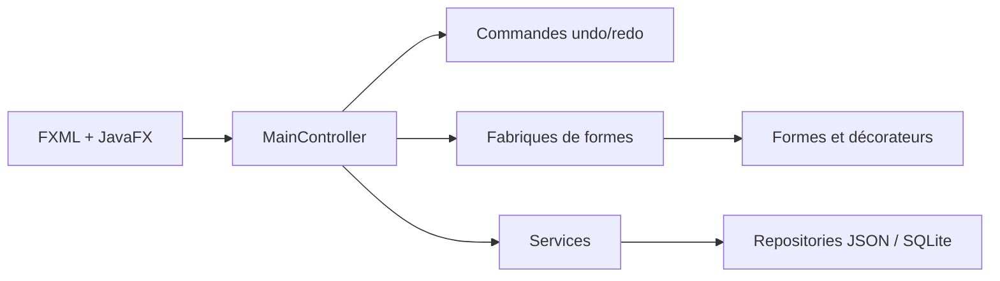

# MiniDrawFX Professional

Application de dessin vectoriel JavaFX conçue autour de patrons de conception
et de plusieurs stratégies de persistance.

## Fonctionnalités

- Création de rectangles, cercles et lignes sur un canevas JavaFX.
- Sélection, suppression, annulation et rétablissement des actions.
- Décorateurs visuels : bordure épaisse, rouge ou discontinue, ombre et halo.
- Persistance des formes au format JSON ou dans une base SQLite locale.
- Export du canevas au format image.

## Stack

Java 21, JavaFX 21, FXML, CSS, SQLite JDBC, Maven et JUnit 5.

## Architecture



Le projet applique notamment Factory, Command, Observer, Strategy, Decorator,
Adapter et Singleton. Chaque responsabilité est isolée dans un package dédié.

## Installation

Prérequis : JDK 21 et Maven 3.9.

```bash
git clone https://github.com/KhaledZouari/minidrawfx.git
cd minidrawfx
mvn verify
mvn javafx:run
```

Maven télécharge JavaFX et le pilote SQLite : aucun chemin local vers un SDK
ou un fichier JAR n’est requis.

## Configuration

Aucune variable d’environnement n’est nécessaire. La base `mindraw.db` est
créée localement à l’exécution et reste exclue de Git. Le fichier
`.env.example` explicite cette absence de configuration externe.

## Tests et qualité

```bash
mvn verify
```

Les tests JUnit vérifient la gestion de la collection centrale de formes. La
CI compile l’application et exécute les tests sur chaque pull request et chaque
push sur `main`.

## Persistance

`ShapeRepository` définit le contrat commun. `JsonShapeRepository` et
`SQLiteShapeRepository` fournissent les deux implémentations sélectionnées par
`RepositoryFactory`.

## Captures d’écran

Les futures captures sont regroupées dans `docs/screenshots/`.

## Choix techniques

- FXML sépare la structure de l’interface du contrôleur.
- Command encapsule les opérations nécessaires à l’annulation/rétablissement.
- Decorator compose les effets graphiques sans multiplier les sous-classes.
- Repository permet de changer la persistance sans modifier les services.

## Pistes d’amélioration

- Tester la géométrie et la sérialisation de chaque type de forme.
- Ajouter des tests d’intégration pour les repositories JSON et SQLite.
- Produire un paquet exécutable avec `jpackage`.

## Licence

Ce projet est distribué sous licence MIT. Voir [LICENSE](LICENSE).
